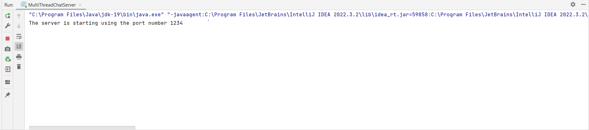
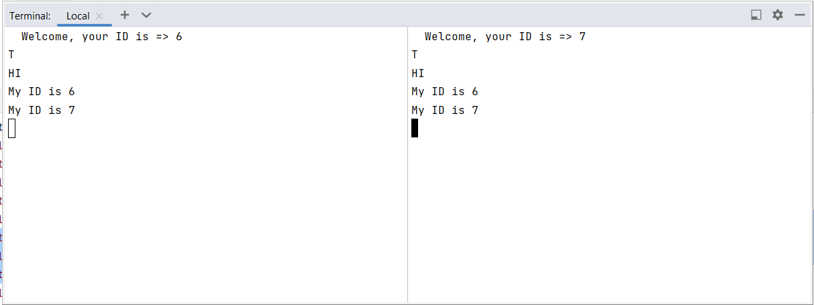
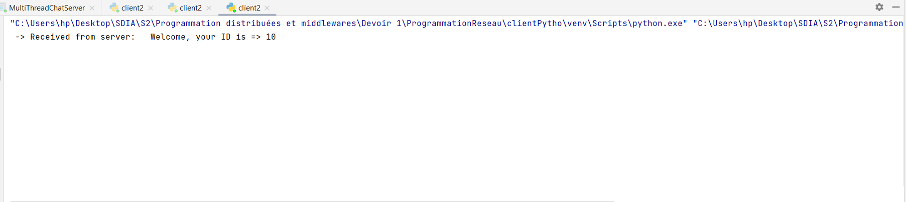
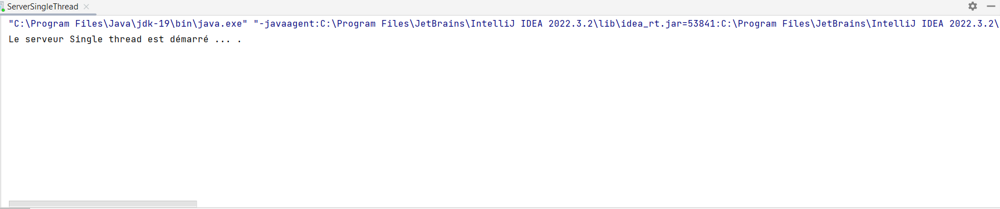
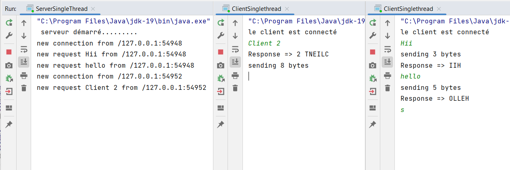
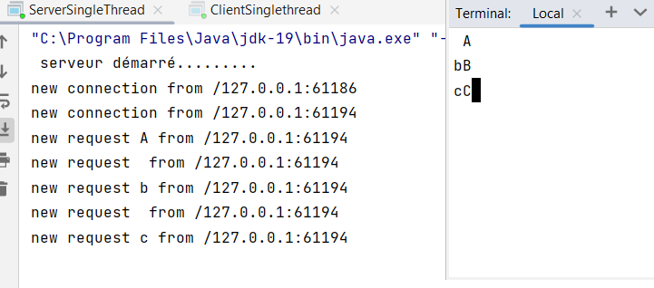

<h3>Compte Rendu</h3>
<h4>Modèle Multi Threads Blocking IO</h4>
<h5>1. Serveur Multi Thread Blocking IO de ChatServer/h5>

<h6>Le serveur avec un client Telnet</h6>

<h6>Le serveur avec un client JAVA avec une interface JAVAFX</h6>

<h6>Le serveur avec un client python</h6>

<h4>Modèle Single Thread avec NonBlocking IO</h4>
<h5>1. Serveur Single Thread utilisant des entrées sorties non bloquantes/h5>

<h6>Le serveur avec un client JAVA</h6>
$
<h6>Le serveur avec un client TELNET</h6>
